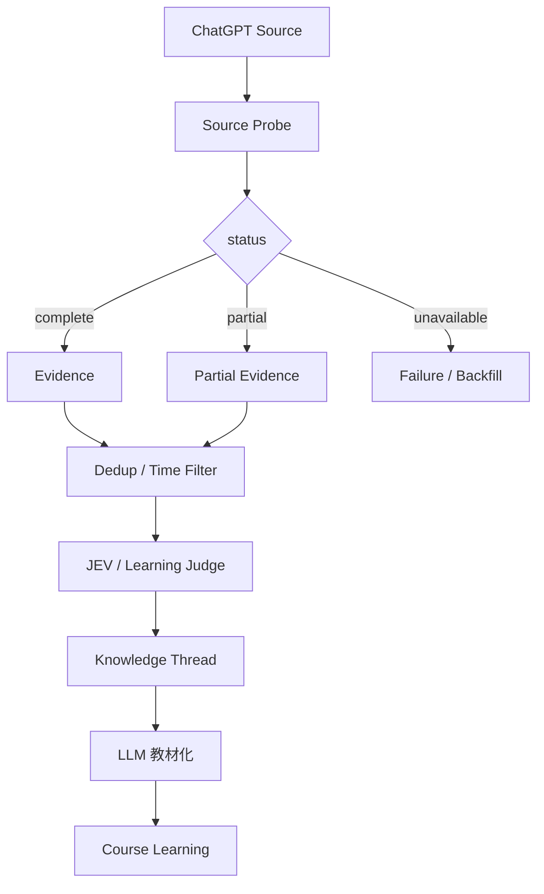

# 2026-09-23｜ChatGPT 日结：证据门禁与失败恢复

> 今天的 ChatGPT 历史会话检索未成功返回可验证 transcript，因此本条不伪造“今日聊天总结”。真正沉淀的是 Daily Compiler 的可靠性规则：**source unavailable 不等于 zero result。**

## 今日解决的问题

每日自动学习系统不能把“检索失败”解释成“今天没有学习内容”。在做 JEV 分类和 LLM 总结前，需要先验证数据源可用性与覆盖范围。

```text
source probe
↓
complete / partial / unavailable
↓
Evidence Gate
↓
只有有证据时才进入语义处理
```

## 核心心智模型

```text
Availability
↓
Integrity
↓
Semantics
↓
Synthesis
↓
Learning State
```

两种空结果必须分开：

```text
complete + []
= 今天确实没有可沉淀内容

unavailable + unknown
= 不知道今天有没有内容
```

## 最小实现

建议给 Daily Compiler 增加：

```ts
type SourceStatus = "complete" | "partial" | "unavailable";

type DailyEvidenceEnvelope = {
  date: string;
  status: SourceStatus;
  items: EvidenceRef[];
  errors: string[];
  collectedAt: string;
};
```

行为约束：

- `complete + 0 items`：允许记录“今日无学习内容”；
- `complete/partial + items`：进入去重、聚类、JEV 分类、教材化；
- `unavailable`：停止知识写入，只记录失败与 backfill 需求；
- `partial`：必须携带 coverage gap；
- 自动日结永远不能直接提升 `learning_progress`。

## 关键流程



## 容易混淆

1. 检索接口报错，不代表今天没有聊天。
2. 历史语义引用不能填补完整 transcript 的证据缺口。
3. 自动写出笔记，只代表 authoring 完成，不代表用户已经掌握。
4. `success([])` 与 `error` 在 Agent / RAG / 数据管线里也必须是两个状态。

## 与现有项目连接

- **PAW**：所有输入源都应该带 provenance / coverage / health，而不仅是 content。
- **Agent Runtime**：工具空结果与工具失败要区分。
- **RAG**：0 docs 与 vector store unavailable 不能混为一谈。
- **Memory**：没有 evidence 就不应升级为稳定 memory atom。
- **后端**：对应 idempotency、watermark、checkpoint、retry、backfill、observability。

详细笔记：

```text
7155/dg-ai-notes
pi-agent/docs/typescript/学习笔记-2026-09-23-ChatGPT日结的证据门禁与失败恢复.md
```

## 复习题

1. 为什么 `unavailable + []` 不能解释成“今天没学习”？
2. Evidence Gate 为什么必须放在 JEV / LLM 前面？
3. `complete / partial / unavailable` 应分别触发什么行为？
4. 为什么自动生成日结不能修改 `learning_progress`？
5. coverage watermark 与后端 checkpoint 的共同点是什么？

## 状态

```yaml
date: 2026-09-23
source_scope: chat_history_retrieval_unavailable
verified_chat_threads: 0
authoring_progress:
  status: captured
  detailed_note_written: true
  course_index_ready: true
learning_progress:
  status: unassessed
  verified_by_recall: false
  verified_by_code_experiment: false
next_learning_evidence:
  - 实现 SourceEnvelope
  - 测试 complete / partial / unavailable
  - 测试 partial -> backfill -> complete 的幂等重放
```
