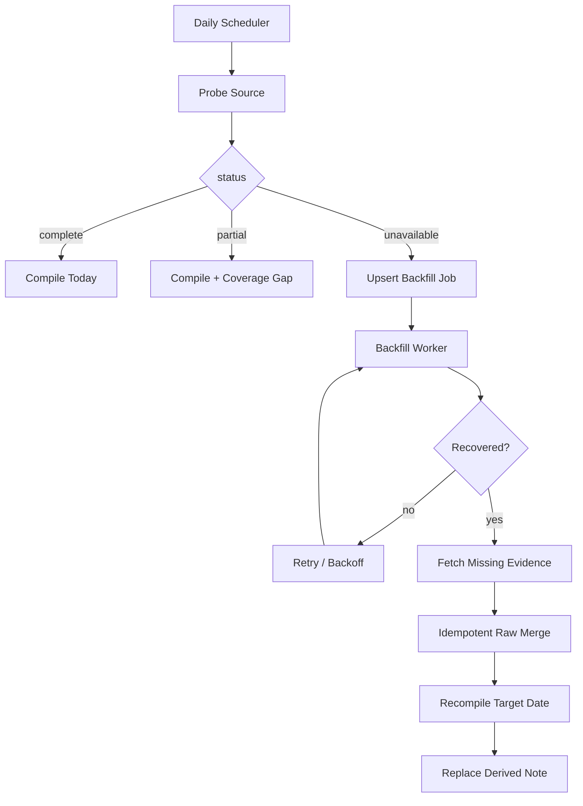

# 2026-09-24｜ChatGPT 日结：Deferred Backfill 与幂等重编译

> 今日历史会话检索仍未返回可验证 transcript，因此不伪造“今天聊了哪些技术主题”。相比昨天的 Evidence Gate，今天新增的工程认识是：**source 连续 unavailable 时，系统需要持久化 Deferred Backfill，而不是每天重复写一条失败日志。**

## 今日解决的问题

Evidence Gate 只能阻止错误总结，不能自动补回缺失日期。

因此 Daily Compiler 需要拆成两条流水线：

```text
Daily Run
= 处理今天的新 evidence

Backfill Worker
= 修复过去缺失的 evidence
```

## 核心心智模型

```text
Source Probe
↓
complete / partial / unavailable
↓
Evidence Gate
↓
若 unavailable
↓
BackfillQueue.upsert(date)
↓
source 恢复
↓
Idempotent Raw Merge
↓
Recompile(date)
↓
Replace Derived View
```

不是：

```text
失败
↓
写一篇“今天没内容”
↓
结束
```

## 关键流程



## 最小实现

```ts
type BackfillStatus =
  | "pending"
  | "running"
  | "blocked"
  | "completed";

type BackfillJob = {
  source: "chat-history" | "chatgpt-web" | "import";
  date: string;
  status: BackfillStatus;
  attempts: number;
  lastError?: string;
  nextRetryAt?: string;
};
```

同一天连续失败必须 `upsert`，而不是生成多个重复 job。

Raw Event 需要稳定 `event_id`，才能保证 backfill 重放时不重复写入。

## 容易混淆

1. Evidence Gate 负责“禁止错误写入”，Backfill Queue 负责“以后补回来”，二者不是一回事。
2. Backfill 成功只修复数据完整性，不代表已经学会。
3. 晚到 evidence 到达后，应从 Raw Evidence **重编译 Derived View**，而不是让 LLM patch 旧 Markdown。
4. `blocked` 表示“覆盖缺口仍存在但自动重试暂停”，不能解释成“没有数据”。

## 与现有项目连接

- **PAW**：ChatGPT、IME、语音、项目文档都可统一成 `SourceEnvelope + BackfillJob + Raw Event + Derived View`。
- **Agent Runtime**：对应 durable state、retry/backoff、resume 与 idempotency。
- **RAG**：索引缺失范围需要显式记录并支持 backfill。
- **Memory**：coverage 不完整时不应把推断升级成稳定 memory atom。
- **后端**：对应 durable queue、retry budget、event replay、materialized view rebuild、checkpoint。

详细教材：

```text
7155/dg-ai-notes
pi-agent/docs/typescript/学习笔记-2026-09-24-ChatGPT日结的Deferred-Backfill与幂等重编译.md
```

## 复习题

1. Evidence Gate 与 Backfill Queue 各解决什么问题？
2. 为什么同一天重复失败要 `upsert BackfillJob`？
3. 为什么 late evidence 更适合触发 Derived View 重编译？
4. Raw Event 的稳定 `event_id` 与幂等重放有什么关系？
5. 为什么 backfill 完成后 `learning_progress` 仍应保持不变？

## 下一步

先实现一个不依赖 LLM 的可靠性闭环：

```text
SourceEnvelope
→ Evidence Gate
→ BackfillQueue
→ Idempotent Raw Merge
→ compile(date)
→ Replace Derived View
```

建议先过 8 组确定性测试，再接 JEV 分类、主题聚类和教材化。

## 状态

```yaml
date: 2026-09-24
source_scope: chat_history_retrieval_unavailable
verified_chat_threads: 0
authoring_progress:
  status: captured
  detailed_note_written: true
  course_index_ready: true
  source_complete: false
  pending_backfill: true
learning_progress:
  status: unassessed
  verified_by_recall: false
  verified_by_code_experiment: false
next_learning_evidence:
  - 实现 BackfillJob durable state
  - 验证重复失败只保留一个 pending job
  - 验证 partial -> complete 后重编译 Derived View
  - 验证 backfill 不修改 learning_progress
```

> 本条不是 2026-09-24 全部 ChatGPT 学习对话的完整摘要；历史会话源不可用，因此没有可验证 transcript。